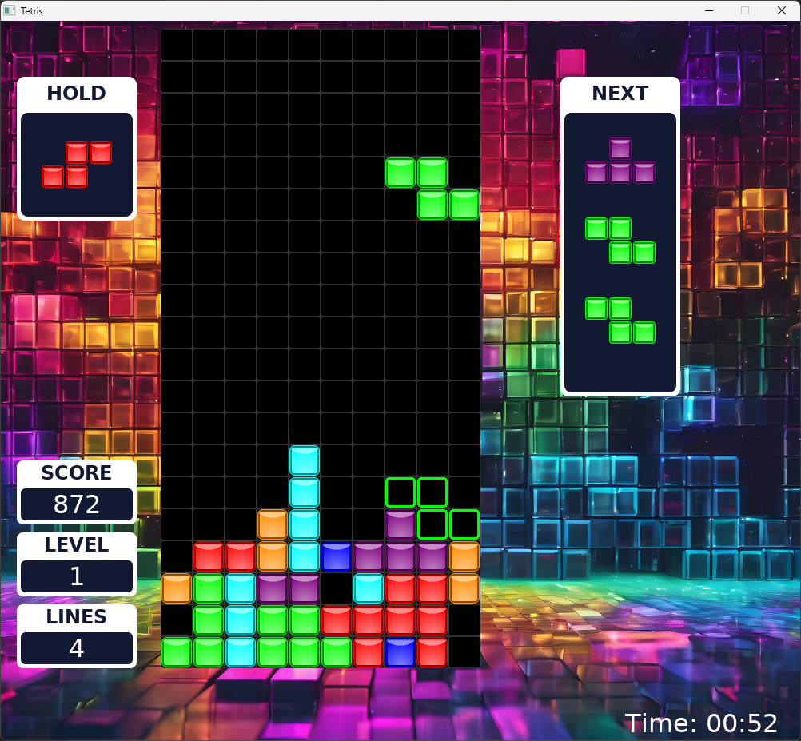

# Tetris (SDL2)

A modern C++ implementation of the classic Tetris game built with **SDL2**, **SDL_ttf**, **SDL_image**, and **SDL_mixer**.  
The project demonstrates advanced rendering, UI integration, and smooth animation effects using the **SDLFormUI** library.

---

## Features

- Modern C++ (C++20) design with object-oriented architecture.
- Smooth block animations (landing, hard drop flash, bubble effects, line clear).
- Custom UI system using the SDLFormUI library for menus, dialogs, and settings.
- Pause, resume, settings, and game-over screens.
- Configurable controls with dynamic key rebinding.
- Mouse control support for intuitive block placement.
- Sound effects and background music (toggleable in settings).
- Persistent themes and safe resource management (RAII-based SDL handling).
- Support for both keyboard and mouse gameplay.

---

## Controls

| Action | Default Key |
|---------|--------------|
| Move Left | Left Arrow |
| Move Right | Right Arrow |
| Rotate Right | Up Arrow |
| Rotate Left | Z |
| Soft Drop | Down Arrow |
| Hard Drop | Space |
| Hold Piece | C |
| Pause / Resume | Escape |

Mouse control and sound can be toggled in the settings screen.

---

## Building

### Requirements

- **SDL2**
- **SDL2_ttf**
- **SDL2_image**
- **SDL2_mixer**

